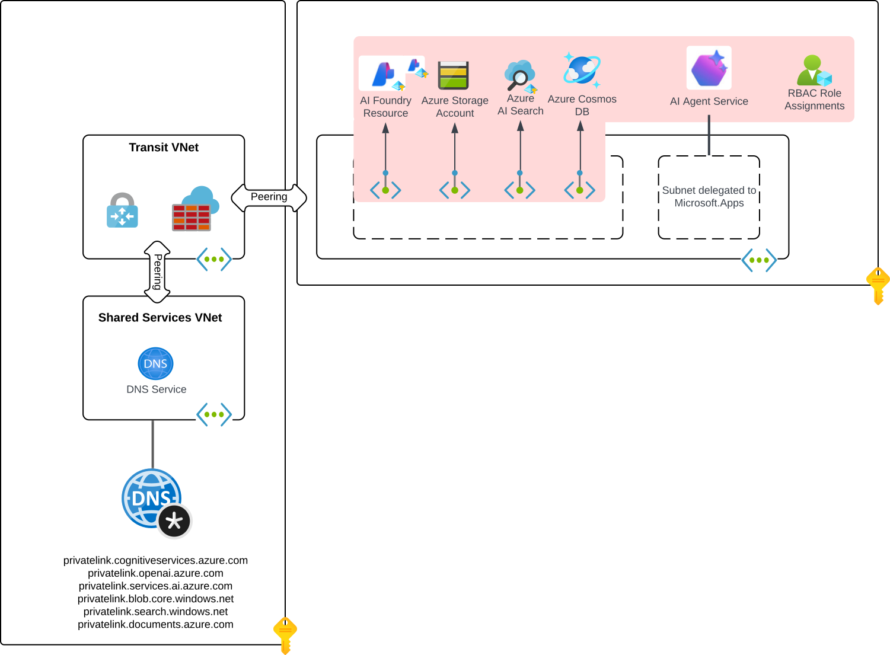

# Microsoft Foundry Agent Service: Standard Agent Setup with E2E Network Isolation with Bring-Your-Own Virtual Network

## Key Information

**Region and Resource Placement Requirements**
- **All Foundry workspace resources should be in the same region as the VNet**, including CosmosDB, Storage Account, AI Search, Foundry Account, Project, Managed Identity. The only exception is within the Foundry Account, you may choose to deploy your model to a different region, and any cross-region communication will be handled securely within our network infrastructure.
  - **Note:** Your Virtual Network can be in a different resource group than your Foundry workspace resources 

---
## Overview
This infrastructure-as-code (IaC) solution deploys a network-secured Microsoft Foundry agent environment with private networking and role-based access control (RBAC).

Standard setup supports private network isolation through utilizing **Bring Your Own Virtual Network (BYO VNet)** approach, also known as **custom VNet support with subnet delegation.** This template is designed for scenarios where a customer has a pre-existing virtual network deployed to a workload subscription which is connected to a platform landing zone where the platform components (such as Private DNS Zones) are stored in the same or a separate subscription.

This implementation gives you full control over the inbound and outbound communication paths for your agent. You can restrict access to only the resources explicitly required by your agent, such as storage accounts, databases, or APIs, while blocking all other traffic by default. This approach ensures that your agent operates within a tightly scoped network boundary, reducing the risk of data leakage or unauthorized access. By default, this setup simplifies security configuration while enforcing strong isolation guarantees, ensuring that each agent deployment remains secure, compliant, and aligned with enterprise networking policies.

If you wish to deploy a standalone deployment that creates all networking resources for you, use the [15a-private-network-standard-agent-setup deployment](../15a-private-network-standard-agent-setup/README.md).

---

## When to Use This Template

Use this template when you need:
- **Full end-to-end network isolation** — All resources behind private endpoints with no public internet access
- **Pre-existing VNet and DNS integration** — You already have a virtual network and Private DNS Zones deployed, possibly in a separate subscription
- **Enterprise landing zone compatibility** — Cross-subscription support for hub-spoke or platform landing zone architectures
- **Standard agent setup with BYO resources** — Customer-managed Storage, Cosmos DB, and AI Search for data residency and compliance
- **System Assigned Managed Identity** — Simplified identity management with platform-managed credentials

### Template Decision Guide

Use the table below to choose the right Terraform infrastructure template for your scenario:

| Template | Agent Type | Networking | Identity | Key Use Case |
|----------|-----------|------------|----------|-------------|
| [**15b** (this template)](../15b-private-network-standard-agent-setup-byovnet/) | Standard (BYO resources) | BYO VNet + Private Endpoints | System Assigned MI | E2E network isolation with pre-existing VNet and cross-subscription DNS |
| [**15a**](../15a-private-network-standard-agent-setup/) | Standard (BYO resources) | BYO VNet + Private Endpoints | System Assigned MI | Standalone E2E network isolation (creates VNet, DNS zones, and resource group) |
| [**17**](../17-private-network-standard-user-assigned-identity-agent-setup/) | Standard (BYO resources) | BYO VNet + Private Endpoints | **User Assigned MI** | Same as 15a but with user-managed identity |
| [**16**](../16-private-network-standard-agent-apim-setup-preview/) | Standard (BYO resources) | BYO VNet + Private Endpoints | System Assigned MI | Same as 15a **plus** private APIM integration (preview) |
| [**19**](../19-hybrid-private-resources-agent-setup/) | Standard (BYO resources) | Hybrid (selective private/public) | System Assigned MI | Hybrid networking with selective private endpoints |
| [**10**](../10-private-network-basic/) | Basic (platform-managed) | BYO VNet + Private Endpoints | System Assigned MI | Basic Foundry with private networking — no agent BYO resources |
| [**41**](../41-standard-agent-setup/) | Standard (BYO resources) | **Public** (no VNet) | System Assigned MI | Standard agents without network isolation |

---

## Prerequisites

1. **Active Azure subscription(s) with appropriate permissions**
  It's recommended to deploy these templates through a deployment pipeline associated to a service principal or managed identity with sufficient permissions over the the workload subscription (such as Owner or Role Based Access Control Administrator and Contributor) and infrastructure subscription (Private DNS Zone Contributor). If deployed manually, the permissions below should be sufficient.

  - **Infrastructure Subscription**
    - **Private DNS Zone Contributor**: Needed over the Private DNS Zones to create the required DNS records for the Private Endpoints
  - **Workload Subscription**
    - **Role Based Access Control Administrator**: Needed over the resource group to create relevant role assignments
    - **Network Contributor**: Needed over the resource group to create the Private Endpoints
    - **Foundry Account Owner**: Needed to create a cognitive services account and project 
    - **Owner or Role Based Access Administrator**: Needed to assign RBAC to the required resources (Cosmos DB, Azure AI Search, Storage) 
    - **Foundry User**: Needed to create and edit agents

2. **Register Resource Providers**

   Make sure you have an active Azure subscription for the workload that allows registering resource providers. For example, subnet delegation requires the Microsoft.App provider to be registered in your subscription. If it's not already registered, run the commands below:

   ```bash
   az provider register --namespace 'Microsoft.KeyVault'
   az provider register --namespace 'Microsoft.CognitiveServices'
   az provider register --namespace 'Microsoft.Storage'
   az provider register --namespace 'Microsoft.Search'
   az provider register --namespace 'Microsoft.Network'
   az provider register --namespace 'Microsoft.App'
   az provider register --namespace 'Microsoft.ContainerService'
   ```

3. Sufficient quota for all resources in your target Azure region

4. Azure CLI installed and configured on your local workstation or deployment pipeline server

5. Terraform CLI version v1.11.4 or later on your local workstation or depoyment pipeline server. This template requires the usage of both the AzureRm and AzApi Terraform providers.

## Pre-Deployment Steps

1. Create a virtual network of sufficient address space. The virtual network should be configured with proper DNS settings to ensure it can resolve the required Private DNS Zones.
  - **Agent Subnet** (e.g., 192.168.0.0/24): Hosts Agent client for Agent workloads 
  - **Private endpoint Subnet** (e.g. 192.168.1.0/24): Hosts private endpoints 
    - Ensure that the address spaces for these subnets do not overlap with any existing networks in your Azure environment or connected on-premises environments.

2. Validate that the subnet that will be delegated to the Agents service has been configured for delegation for Microsoft.App/environments. Without this delegation the deployment will fail.

3. Create the Private DNS Zones listed below. Ensure they are linked to the relevant virtual network which will depend on your DNS resolution pattern for Azure.

    - privatelink.cognitiveservices.azure.com
    - privatelink.openai.azure.com
    - privatelink.services.ai.azure.com
    - privatelink.blob.core.windows.net
    - privatelink.search.windows.net
    - privatelink.documents.azure.com

### Limitations / Known Issues

1. The delegated agent subnet must be exclusively used by a single Foundry account. It cannot be shared across accounts.
2. The Foundry resource and the virtual network must be in the same Azure region. BYO resources (Storage, Cosmos DB, AI Search) may be in different regions.
3. Private Class A IP address ranges (10.x.x.x) are only supported in the following regions: **Australia East, Brazil South, Canada East, East US, East US 2, France Central, Germany West Central, Italy North, Japan East, South Africa North, South Central US, South India, Spain Central, Sweden Central, UAE North, UK South, West US, West US 3.** Use Class B (172.16.x.x) or C (192.168.x.x) ranges for other regions.
4. This template does **not** support tools (MCP servers, OpenAPI tools, Azure Functions, A2A) behind the VNet. Use [template 19](../19-hybrid-private-resources-agent-setup/) for that scenario.
5. There is no upgrade path from BYO VNet (this template) to Managed Virtual Network. A Foundry resource redeployment is required.
6. All projects within the same Foundry account share model deployments. Per-project model isolation is not supported.
7. Cosmos DB is deployed as single-region. Multi-region replication must be configured manually post-deployment.

### Account Deletion Prerequisites and Cleanup Guidance

Before deleting an **Account** resource, it is essential to first delete the associated **Account Capability Host**. Failure to do so may result in residual dependencies—such as subnets and other provisioned resources (e.g., ACA applications)—remaining linked to the capability host. This can lead to errors such as **"Subnet already in use"** when attempting to reuse the same subnet in a different account deployment.

**Cleanup Options**

**1. Full Account Removal**: To completely remove an account, you must delete and purge the account. Simply deleting the account is not sufficient, you must purge so that deletion of the associated capability host is triggered. The service will automatically handle the removal of the capability host and any linked resources in the background. To purge the account, use the following [link](https://learn.microsoft.com/en-us/azure/ai-services/recover-purge-resources?tabs=azure-portal#purge-a-deleted-resource). Please allow approximately max of 20 minutes for all resources to be fully unlinked from the account.

**2. Retain Account, Remove Capability Host**: If you intend to retain the account but remove the capability host, you must delete the capability host resource directly. After deletion, allow approximately max of 20 minutes for all resources to be fully unlinked from the account.

> **Important**: Before deleting the account capability host, ensure that the **project capability host** is deleted first.

---

## Template Customization

Note: The following resources will be created automatically for you:
- Azure Cosmos DB for NoSQL  
- Azure AI Search
- Azure Storage
- Microsoft Foundry resource
- Private Endpoints for resources above

### Variables

The variables listed below [must be provided](https://developer.hashicorp.com/terraform/language/values/variables#variable-definition-precedence) when performing deploying the templates. The file example.tfvars provides a sample Terraform variables file that can be used.
- **resource_group_name_resources** - The name of the resource group where the resources created with this template will be depoyed to.
- **resource_group_name_dns** - This name of the resource group where the pre-existing Private DNS Zones have been deployed to.
- **subnet_id_agent** - The Azure resource ID of the subnet that will be delegated to the Agent service. This subnet must be delegated to Microsoft.App/environments prior to deployment of the resources.
- **subnet_id_private_endpoint** - This Azure resource id of the subnet where Private Endpoints created by this template will be deployed.
- **subscription_id_resources** - The subscription ID (ex: 55555555-5555-5555-5555-555555555555) that the resources created with this template will be deployed to.
- **subscription_id_infra** - The subscription ID (ex: 55555555-5555-5555-5555-555555555555) where the pre-existing Private DNS zones have been deployed to.
- **location** - The Azure region the resources will be deployed to. This must be the same region where the pre-existing virtual network has been deployed to.

## Deploy the Terraform template

1. Fill in the required information for the variables listed in the example.tfvars file and rename the file to terraform.tfvars.

2. If performing the deployment interactively, log in to Az CLI with a user that has sufficient permissions to deploy the resources.

```bash
az login
```

3. Ensure the proper environmental variables are set for [AzApi](https://registry.terraform.io/providers/Azure/azapi/latest/docs) and [AzureRm](https://registry.terraform.io/providers/hashicorp/azurerm/latest/docs) providers. At a minimum, you must set the ARM_SUBSCRIPTION_ID environment variable to the subscription the Foundry resoruces will be deployed to. You can do this with the commands below:

Linux/MacOS
```bash
export ARM_SUBSCRIPTION_ID="YOUR_SUBSCRIPTION_ID"
```

Windows
```cmd
set ARM_SUBSCRIPTION_ID="YOUR_SUBSCRIPTION_ID"
```

PowerShell Command Prompt
```
$env:ARM_SUBSCRIPTION_ID="YOUR_SUBSCRIPTION_ID"
```

4. Initialize Terraform

```bash
terraform init
```

5. Deploy the resources
```bash
terraform apply
```

> **Note:** To access a private Foundry resource securely, use one of the following:
> - A VM or jump box on the virtual network, optionally accessed through Azure Bastion
> - Azure VPN Gateway
> - Azure ExpressRoute

### Cleanup

To delete all resources created by this template, run:

```bash
terraform destroy
```

> **Important**: If you need to reuse the same subnet, follow the [Account Deletion Prerequisites and Cleanup Guidance](#account-deletion-prerequisites-and-cleanup-guidance) to properly purge the account and wait for the capability host to fully unlink (~20 minutes).

## Architecture Overview

The architecture this deployment supports is pictured below with the resources deployed by these templates highlighted in red. You can reference official Microsoft documentation for details on the networking set-up on [Microsoft Learn](https://learn.microsoft.com/en-us/azure/ai-foundry/agents/how-to/virtual-networks).




```
┌─────────────────────────────────────────────────────────────────────┐
│  Secure Access (VPN Gateway / ExpressRoute / Azure Bastion)         │
└──────────────────────────────────┬──────────────────────────────────┘
                                   │
                    ┌──────────────▼──────────────┐
                    │   Microsoft Foundry          │
                    │   (publicNetworkAccess:      │
                    │        DISABLED)             │
                    │                              │
                    │  ┌────────────────────────┐  │
                    │  │   Foundry Project       │  │
                    │  │   (Agent Workspace)     │  │
                    │  └───────────┬────────────┘  │
                    └──────────────┼──────────────┘
                                   │ Subnet Delegation
                    ┌──────────────▼──────────────┐
                    │   BYO Virtual Network        │
                    │   (Pre-existing)             │
                    │                              │
                    │  ┌──────────────────────┐    │
                    │  │ Agent Subnet          │   │
                    │  │ (e.g. 192.168.0.0/24) │   │  ◄── Delegated to
                    │  │ Microsoft.App/envs    │   │      Microsoft.App/environments
                    │  └──────────────────────┘    │
                    │                              │
                    │  ┌──────────────────────┐    │
                    │  │ PE Subnet             │   │
                    │  │ (e.g. 192.168.1.0/24) │   │
                    │  │                       │   │
                    │  │ ┌────────┐ ┌────────┐ │   │
                    │  │ │Storage │ │Cosmos  │ │   │  ◄── Private endpoints
                    │  │ └────────┘ └────────┘ │   │      (no public access)
                    │  │ ┌────────┐ ┌────────┐ │   │
                    │  │ │Search  │ │Foundry │ │   │
                    │  │ └────────┘ └────────┘ │   │
                    │  └──────────────────────┘    │
                    └──────────────────────────────┘
```


### Step-by-Step Provisioning Process (main.tf)

1. Create dependent resources for standard setup:
   - Create new Cosmos DB resource
   - Create new Azure Storage resource
   - Create new Azure AI Search resource

2. Create Microsoft Foundry Resource (Cognitive Services/accounts, kind=AIServices)

3. Create account-level connections:
   - Deploy GPT-4o or other agent-compatible model

4. Create private endpoints with DNS resolution for the Azure Resources: Azure Cosmos DB Account, Azure Storage Storage, Azure AI Search, and Microsoft Foundry

5. Create Project (Cognitive Services/accounts/project)

6. Create project connections:
   - Create project connection to Azure Storage account
   - Create project connection to Azure AI Search account
   - Create project connection to Cosmos DB account

7. Assign the project-managed identity (including for SMI) the following roles:
   - Cosmos DB Operator at the scope of the account level for the Cosmos DB account resource
   - Storage Account Contributor at the scope of the account level for the Storage Account resource

8. Set Account capability host with empty properties section.

9. Set Project capability host with properties: Cosmos DB, Azure Storage, AI Search connections

10. Assign the Project Managed Identity (both for SMI and UMI) the following roles on the specified resource scopes:
   - Azure AI Search: Search Index Data Contributor, Search Service Contributor
   - Azure Blob Storage Container: <workspaceId>-azureml-blobstore: Storage Blob Data Contributor
   - Azure Blob Storage Container: <workspaceId>-agents-blobstore: Storage Blob Data Owner
   - Cosmos DB for NoSQL container: <'${projectWorkspaceId}>-thread-message-store: Cosmos DB Built-in Data Contributor
   - Cosmos DB for NoSQL container: <'${projectWorkspaceId}>-system-thread-message-store: Cosmos DB Built-in Data Contributor
   - Cosmos DB for NoSQL container: <'${projectWorkspaceId}>-agent-entity-store: Cosmos DB Built-in Data Contributor

The deployment creates an isolated network environment:

- **Private Endpoints:**
  - Microsoft Foundry
  - AI Search
  - CosmosDB
  - Storage

### Post Deployment

1. Once all resources are provisioned, assign all developers who want to create/edit agents in the project the role: Foundry User on the project scope.

### Core Components

1. **Microsoft Foundry Resource**
   - Central orchestration point
   - Manages service connections
   - Set networking and policy configurations

2. **AI Project**
   - Defines the workspace configuration
   - Service integration
   - Agents are created within a specific project, and each project acts as an isolated workspace. This means:
     - All agents in the same project share access to the same file storage, thread storage (conversation history), and search indexes.
     - Data is isolated between projects. Agents in one project cannot access resources from another.

3. **Bring Your Own (BYO) Azure Resources**: ensures all sensitive data remains under customer control. All agents created using our service are stateful, meaning they retain information across interactions. With this setup, agent states are automatically stored in customer-managed, single-tenant resources. The required Bring Your Own Resources include:
   - **BYO File Storage**: All files uploaded by developers (during agent configuration) or end-users (during interactions) are stored directly in the customer's Azure Storage account.
   - **BYO Search**: All vector stores created by the agent leverage the customer's Azure AI Search resource.
   - **BYO Thread Storage**: All customer messages and conversation history will be stored in the customer's own Azure Cosmos DB account.

By bundling these BYO features (file storage, search, and thread storage), the standard setup guarantees that your deployment is secure by default. All data processed by Microsoft Foundry Agent Service is automatically stored at rest in your own Azure resources, helping you meet internal policies, compliance requirements, and enterprise security standards.

### Azure Resources Created

**Microsoft Foundry (Cognitive Services)**
- Type: Microsoft.CognitiveServices/accounts
- Kind: AIServices
- SKU: S0
- Identity: System-assigned
- Features:
  - Custom subdomain name
  - Disabled public network access
  - Network ACLs with Azure Services bypass

**AI Model Deployment**
- Type: Microsoft.CognitiveServices/accounts/deployments
- SKU: Based on deployment configuration, capacity set by model capacity
- Model properties:
  - Name, Format, and Version configurable via variables

**Azure AI Search**
- Type: Microsoft.Search/searchServices
- SKU: standard
- Partition Count: 1
- Replica Count: 1
- Hosting Mode: default
- Features:
  - Disabled public network access
  - AAD auth with HTTP 401 challenge
  - System-assigned managed identity

**Storage Account**
- Type: Microsoft.Storage/storageAccounts
- Kind: StorageV2
- SKU: ZRS or GRS (region dependent)
- Features:
  - Blob service
  - Minimum TLS Version: 1.2
  - Block public blob access
  - Disabled public network access
  - Force Azure AD authentication (SharedKey access disabled)

**Cosmos DB Account**
- Type: Microsoft.DocumentDB/databaseAccounts
- Kind: GlobalDocumentDB (SQL API)
- Consistency Level: Session
- Database Account Offer Type: Standard
- Features:
  - Disabled public network access
  - Disabled local auth
  - Single region deployment

### Network Security Design

This implementation utilizes a BYO VNet (Bring Your Own Virtual Network) approach with subnet delegation. The pre-existing virtual network must include subnets for agent delegation and private endpoints.

**Private Endpoints**

Private endpoints ensure secure, internal-only connectivity. Private endpoints are created for the following:
- Microsoft Foundry
- Azure AI Search
- Azure Storage
- Azure Cosmos DB

**Private DNS Zones**

| Private Link Resource Type | Sub Resource | Private DNS Zone Name | Public DNS Zone Forwarders |
|----------------------------|--------------|------------------------|-----------------------------|
| **Microsoft Foundry**       | account      | `privatelink.cognitiveservices.azure.com`<br>`privatelink.openai.azure.com`<br>`privatelink.services.ai.azure.com` | `cognitiveservices.azure.com`<br>`openai.azure.com`<br>`services.ai.azure.com` |
| **Azure AI Search**        | searchService| `privatelink.search.windows.net` | `search.windows.net` |
| **Azure Cosmos DB**        | Sql          | `privatelink.documents.azure.com` | `documents.azure.com` |
| **Azure Storage**          | blob         | `privatelink.blob.core.windows.net` | `blob.core.windows.net` |

---

## Security Features

### Authentication & Authorization

- **Managed Identity**
  - Zero-trust security model
  - No credential storage
  - Platform-managed rotation

- **Role Assignments**
  - **Azure AI Search**
    - Search Index Data Contributor (`8ebe5a00-799e-43f5-93ac-243d3dce84a7`)
    - Search Service Contributor (`7ca78c08-252a-4471-8644-bb5ff32d4ba0`)
  - **Azure Storage Account**
    - Storage Blob Data Owner (`b7e6dc6d-f1e8-4753-8033-0f276bb0955b`)
    - Storage Queue Data Contributor (`974c5e8b-45b9-4653-ba55-5f855dd0fb88`) (if Azure Function tool enabled)
    - Two containers will automatically be provisioned during the create capability host process:
      - Azure Blob Storage Container: `<workspaceId>-azureml-blobstore`
        - Storage Blob Data Contributor
      - Azure Blob Storage Container: `<workspaceId>-agents-blobstore`
        - Storage Blob Data Owner
  - **Key Vault**
    - Key Vault Contributor (`f25e0fa2-a7c8-4377-a976-54943a77a395`)
    - Key Vault Secrets Officer (`b86a8fe4-44ce-4948-aee5-eccb2c155cd7`)
  - **Cosmos DB for NoSQL**
    - Cosmos DB Operator (`230815da-be43-4aae-9cb4-875f7bd000aa`)
    - Cosmos DB Built-in Data Contributor
    - Three containers will automatically be provisioned during the create capability host process:
      - Cosmos DB for NoSQL container: `<${projectWorkspaceId}>-thread-message-store`
      - Cosmos DB for NoSQL container: `<${projectWorkspaceId}>-system-thread-message-store`
      - Cosmos DB for NoSQL container: `<${projectWorkspaceId}>-agent-entity-store`

### Network Security

- Public network access disabled
- Private endpoints for all services
- Network ACLs with deny by default

---
## Module Structure

```text
code/
├── data.tf                                         # Creates data objects for active subscription being deployed to and deployment security context
├── locals.tf                                       # Creates local variables for project GUID
├── main.tf                                         # Main deployment file        
├── outputs.tf                                      # Placeholder file for future outputs
├── providers.tf                                    # Terraform provider configuration 
├── example.tfvars                                  # Sample tfvars file
├── variables.tf                                    # Terraform variables
├── versions.tf                                     # Configures minimum Terraform version and versions for providers
```

## Maintenance

### Regular Tasks

1. Review role assignments
2. Monitor network security
3. Check service health
4. Update configurations as needed

### Troubleshooting

1. Verify private endpoint connectivity
2. Check DNS resolution
3. Validate role assignments
4. Review network security groups

---

## References

- [Microsoft Foundry Networking Documentation](https://learn.microsoft.com/en-us/azure/ai-foundry/how-to/configure-private-link?tabs=azure-portal&pivots=fdp-project)
- [Microsoft Foundry RBAC Documentation](https://learn.microsoft.com/en-us/azure/ai-foundry/concepts/rbac-azure-ai-foundry?pivots=fdp-project)
- [Private Endpoint Documentation](https://learn.microsoft.com/en-us/azure/private-link/)
- [RBAC Documentation](https://learn.microsoft.com/en-us/azure/role-based-access-control/)
- [Network Security Best Practices](https://learn.microsoft.com/en-us/azure/security/fundamentals/network-best-practices)
