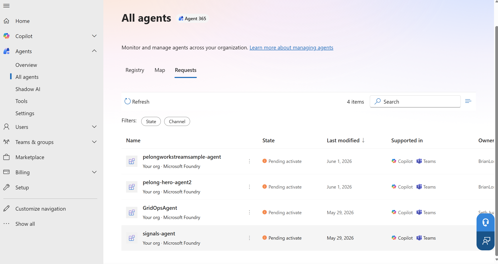
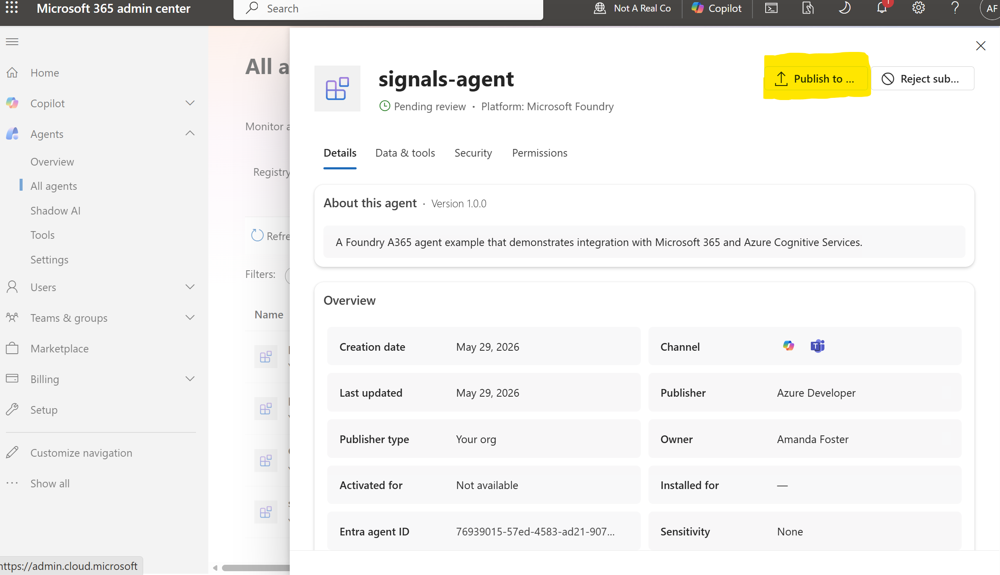
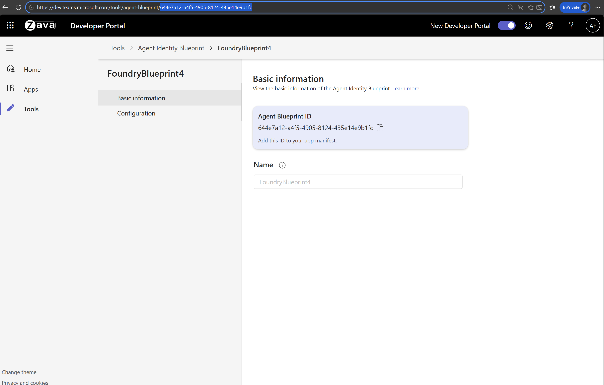
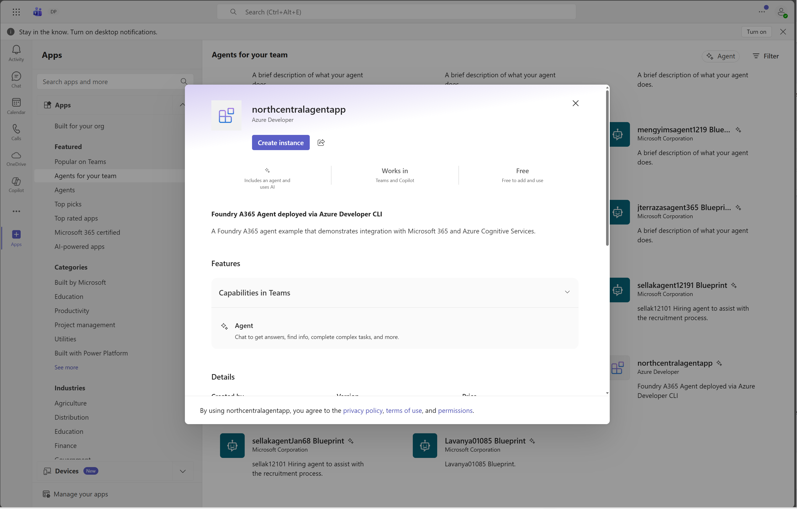

# 🤖 Workstream Manager Agent

> A Foundry A365 agent that tracks work items, provides workstream summaries, and operates in manager-only direct message mode.

**Note:** This agent will currently only respond in group chats if you @mention it.

---

## 📋 Prerequisites

**Note:** You must be enrolled in the [Frontier preview program](https://adoption.microsoft.com/en-us/copilot/frontier-program/) to publish a Foundry agent to Microsoft Agent 365.

Ensure you have the following installed:

| Requirement | Description |
|------------|-------------|
| [Azure Developer CLI](https://learn.microsoft.com/azure/developer/azure-developer-cli/install-azd) | Infrastructure deployment tool |
| [.NET 9.0 SDK](https://dotnet.microsoft.com/download) | Development framework |


### 🔐 Required Permissions

- **Owner** role on the Azure subscription
- **Azure AI User** or **Cognitive Services User** role at subscription or resource group level
- **Tenant Admin** role for organization-wide configuration

---

## 🤖 Agent Functionality

### Overview

The Foundry Workstream Manager is an autopilot agent grounded in dynamic knowledge drawn from the group chat's conversation history — every message, file, link, GitHub PR — as well as documents and context from any other sources you choose, such as your team's SharePoint site, product specs, and public documentation.

In a group chat, it can track tasks and deadlines, summarize conversations into action items, follow up on overdue work, surface risks and blockers, and coordinate updates across stakeholders.

To bring this to life, we're starting with a practical, high-impact use case: a workstream manager autopilot agent designed to live in Teams group chats. We've created an out-of-the-box code sample you can easily customize and connect to your own enterprise data and workflows.

### User model

| Role | Configuration | Capabilities | Surfaces |
|------|---------------|--------------|----------|
| **Admin/Manager** | Person who creates the autopilot instance | Manages teammate list; gives the agent permissions and configures its behavior; runs `/workstreamsummary run`; can chat with the agent | Teams DM, Teams group chats |
| **Teammates** | Added by the admin (`/access add`) | Can use the autopilot agent | Teams DM, Teams group chats |
| **Non-teammates** | N/A | Blocked from using the autopilot. If a non-teammate DMs the agent, it redirects them to a channel it's in and declines to respond further. | Agent won't respond in channels or group chats that include non-teammates |

### Interaction surfaces

The autopilot agent is designed to live in Teams group chats and Teams 1:1 DMs.

### Capabilities

- **Manager onboarding flow** — On first DM from the manager (the person who creates the agent instance), the agent introduces itself and walks them through setup: granting access, how it tracks work items, and pulling summaries. Run `/onboarding` anytime to change preferences. *(Manager only.)*
- **Manager-controlled access** — By default only the manager can talk to it; they extend access with `/access add`, `/access remove`, and `/access list <upn>`. In group chats, every participant must be approved. The management commands — `/onboarding`, `/access`, and `/workstreamsummary` — are **manager-only** (the manager is resolved via Microsoft Graph `/me/manager`); approved teammates can chat with the agent but can't run them.
- **Tracks open items** — Captures every commitment that needs follow-up — any time someone agrees to look into something and report back. These are often small, easily forgotten items like "Amanda will file a bug for that" or "can you check with {person} about that." It marks the logged message with 📌, and the owner, description, status, and ETA persist across sessions, so you can ask later who's on what.
  - When the LLM identifies an action item it calls `create_work_item`; items are stored in Azure Table Storage (owner, description, status, ETA, and changelog), and owner AAD object IDs are resolved automatically via Microsoft Graph.
  - Tools: `create_work_item`, `list_work_items`, `update_work_item`, `close_work_item`.
- **On-demand workstream summary** — Run `/workstreamsummary run` for a digest of open items grouped by owner — a natural starting point for a recurring daily or weekly digest. *(Manager only.)*
- **Workstream Q&A** — Answers questions about the workstream from conversation history plus any sources you grant it: SharePoint and specs (Azure DevOps planned).
- **Built-in Microsoft 365 (WorkIQ) tools** — Pre-wired with Microsoft 365 tools: Word, Excel, Outlook calendar, OneDrive/SharePoint. Ask it to draft an email, summarize a spec, or pull last week's notes, and it goes straight to the source. Ask it to create a Word document, and it does so in its own OneDrive.
- **Reacts to messages** — Messages it decides to reply to receive a 👍 reaction.

### Customization

**During agent development** (persona: developer)

- **Agent instructions:** [AgentInstructions.cs](./src/workstream_manager_agent/AgentLogic/AgentInstructions.cs)
- **MCP tools:** [ToolingManifest.json](./src/workstream_manager_agent/ToolingManifest.json) — [Learn more](https://learn.microsoft.com/en-us/microsoft-agent-365/tooling-servers-overview)
- **Group-chat access response:** Set `GroupChatUnauthorizedResponse` to customize the message shown when a group chat includes unapproved participants (`{Manager}`, `{UnauthorizedCount}`, `{UnauthorizedParticipants}` placeholders).
- **Cross-tenant access guard:** Set `CrossTenantUnauthorizedResponse` to customize the canned no-op response for users outside the digital worker tenant.
- **Assign agent permissions (inheritable scopes):** As blueprint owner, declare the inheritable Graph/MCP delegated scopes the agent needs on the blueprint (e.g., `ChatMessage.Send`, `McpServers.Word.All`); these are consented at admin approval. Done during deployment, before any instance is created.

**After the agent instance is created** (persona: agent manager)

- **Direct-message access control:** Managers can manage a per-digital-worker allowlist in Teams direct message using:
  - `/access list`
  - `/access add <user-object-id-or-upn-or-mention>`
  - `/access remove <user-object-id-or-upn-or-mention>`
  - `azd provision` creates and wires Azure Table Storage for allowlist persistence across sessions (table defaults to `digitalworkerallowlist`).
- **Assign agent permissions:** After hiring, the manager grants the agent instance access to the specific resources it should use — just like you would for a person — for example, adding it to a security group or a team SharePoint site, or sharing a Word document with it.

---

## 🚀 Quick Start

### Step 1: Authenticate

Login to your Azure tenant and authenticate with Azure Developer CLI:

Based on tenant security settings, sometimes just az login might be sufficient, sometimes one will need to login to each scope that is used in these scripts.

```powershell
# Login to Azure CLI
az login

az login --scope https://ai.azure.com/.default

az login --scope https://graph.microsoft.com//.default

az login --scope https://management.azure.com/.default
# Login to Azure Developer CLI
azd auth login
```

### Step 2: Deploy

> **📍 Region availability:** This sample uses [Foundry hosted agents](https://learn.microsoft.com/en-us/azure/foundry/agents/quickstarts/quickstart-hosted-agent?pivots=azd). Your Foundry account and other resources must be in a region where hosted agents are available. At the time of writing, supported regions are:
>
> Australia East, Brazil South, Canada Central, Canada East, East US, East US 2, France Central, Germany West Central, Italy North, Japan East, Korea Central, North Central US, Norway East, Poland Central, South Africa North, South Central US, South India, Southeast Asia, Spain Central, Sweden Central, Switzerland North, UAE North, UK South, West Central US, West US, West US 3.

```powershell
azd provision
```

After deployment completes, retrieve your resource values:

```powershell
azd env get-values
```

### Step 3: Review and Publish the Agent Request

1. Navigate to the [Microsoft 365 admin center](https://admin.cloud.microsoft/?#/agents/all/requested)
2. Under **Requests**, locate your pending agent request:
   

3. Open the request and click **Publish to store**:
   

### Step 4: Configure Teams Integration

After approving the agent blueprint, configure it in the Teams Developer Portal:

1. Open the [Teams Developer Portal](https://dev.teams.microsoft.com/tools/agent-blueprint) and locate your approved agent blueprint.
    
   **Note:** Only 100 Agent Blueprints are displayed. If yours isn't visible, click any blueprint to open its details page, then in the browser's address bar replace the blueprint ID portion of the URL with your own Blueprint ID from the previous step (for example: `https://dev.teams.microsoft.com/tools/agent-blueprint/<your-blueprint-id>`).
   

2. Get your Blueprint ID:
   ```powershell
   azd env get-values
   ```

3. Navigate to **Configuration** and add your **Bot ID** (same as Blueprint ID):
   

### Step 5: Create Agent Instances

After configuring the agent blueprint in Teams Developer Portal, you can now create agent instances based on your blueprint:

1. In Microsoft Teams, navigate to **Apps** → **Agents for your team**. Note: may only be available on Teams through browser.
2. Find the agent named by your `AGENT_NAME` value and create an instance:
   ```powershell
   azd env get-value AGENT_NAME
   ```
   

---

## 🔄 Updating the Agent After Code Changes

When you change the agent source code (anything under `src/`), re-run:

```powershell
azd provision
```

This re-runs the `postprovision` hook, which:

1. **Rebuilds and pushes the container image** via ACR Build (`scripts/build-docker-image-acr.ps1`).
2. **Registers a new agent version** that points at the freshly built image (`scripts/agent-creation-script.ps1`), polls until it is `active`, and re-applies the endpoint protocol/auth configuration.

Steps 1 and 2 run on **every** `azd provision`. The one-time digital worker setup steps — **publishing the digital worker**, creating the **blueprint SP OAuth2 grants**, and **adding you as blueprint owner** — are skipped on re-runs once they have completed (a `DIGITAL_WORKER_SETUP_DONE` marker is persisted in the azd environment). The published digital worker references the agent GUID, not a specific version, so new versions are served without re-publishing. You also do **not** need to recreate the blueprint or bot service — those are idempotent ARM resources.

To force the one-time setup steps to run again (e.g. after changing publish metadata or blueprint scopes):

```powershell
azd env set DIGITAL_WORKER_SETUP_DONE ""
azd provision
```

> **⚠️ Traffic routing & draining:** Creating a new agent version does not instantly move every live session onto it. When you shift endpoint traffic routing to the new version, **existing sessions continue to run on the previous version until they go idle**, so two versions can be active at once. Use the per-version telemetry queries in [Monitoring & Observability](#-monitoring--observability) (slice `requests` by `application_Version`) to watch the cutover and confirm when the old version has fully drained.

---

## 🔧 Deployment Reference: `/infra` + Post-Provision Scripts

`azd provision` runs in two phases: **(1)** it deploys the Bicep in `/infra`, then **(2)** it runs the `postprovision` hook (`scripts/post-provision.ps1`). The key distinction for permissions: `/infra` creates **managed-identity** role assignments (for the agent's runtime identities), while the post-provision **scripts run as *you*** and therefore require **your** user/directory roles.

### Phase 1 — `azd provision` deploys `/infra`

Creates the environment resources:

- **Foundry account** (Cognitive Services `AIServices`, system-assigned managed identity).
- **Foundry project** (child of the account, system-assigned managed identity).
- **Azure Container Registry** (ACR) — hosts the agent image.
- **Model deployment** (default: `gpt-5-chat`, version `2025-10-03`).
- **User-Assigned Managed Identity (UMI)** used to run a PowerShell **deployment script** that creates the **Agent Blueprint** (a dataplane operation). The blueprint is created here — *before* agent creation — because the **Bot Service** is created up front and requires the blueprint's client ID to already exist.
- **Bot Service** — `msaAppId` is the Agent Blueprint client ID; its `endpoint` is the deterministic agent endpoint URL you will create later (`https://${accountName}.services.ai.azure.com/api/projects/${projectName}/agents/${agentName}/endpoint/protocols/activityProtocol?api-version=2025-05-15-preview`). A **Microsoft Teams channel** is then connected to the Bot Service.
- **Azure Storage account + two tables** (`digitalworkerallowlist`, `workitems`) for allowlist and work-item persistence.
- **Monitoring resources** (Log Analytics + Application Insights + project AppInsights connection) — only when `ENABLE_MONITORING=true` (default). See [Monitoring & Observability](#-monitoring--observability).
- **Project connections** — an **Application Insights connection** is created on the Foundry project (only when `ENABLE_MONITORING=true`) so the agent emits telemetry. This sample does **not** create a separate Azure Container Registry connection; the project pulls images via the **AcrPull** role assignment instead (see below).

Role assignments created by `/infra` (all granted to **managed identities**, never to your user):

| Role | Granted to | Scope | Why it's needed |
|------|-----------|-------|-----------------|
| **AcrPull** | Foundry project system MI | Container Registry | Pull the agent container image from the registry at runtime |
| **Cognitive Services User** | Foundry project system MI | Foundry account | Access the deployed model |
| **Contributor** | Deployment-script UMI | Resource group | Lets the deployment script create the Agent Blueprint (a data-plane operation run via the UMI) |
| **Cognitive Services User** | Deployment-script UMI | Resource group | Gives the deployment-script UMI the Cognitive Services data-plane access it uses during blueprint creation |
| **Log Analytics Reader** *(if monitoring enabled)* | Foundry project MI | Application Insights | Read telemetry for running evaluations over agent traces |

> `/infra` does **not** grant **you** any roles (e.g., it does not give you ACR Contributor). Your ability to run the post-provision scripts comes from your own subscription/tenant roles — see the prerequisites and Phase 2 below.

### Phase 2 — the `postprovision` hook runs the scripts

The scripts below run under **your `az` / `azd` login**, so the permissions listed are what **you (the person running `azd provision`)** must hold. Permissions fall into three buckets: **Azure RBAC** (control plane), **Foundry data-plane** (token for `https://ai.azure.com`), and **Entra directory roles / Microsoft Graph** (token for `https://graph.microsoft.com`).

| Script | What it does | Permissions required to run |
|--------|--------------|-----------------------------|
| `post-provision.ps1` | Orchestrator — runs the one-time setup scripts and gates them behind the `DIGITAL_WORKER_SETUP_DONE` azd env marker. The scripts run in dependency order: become blueprint owner → declare OAuth2 grants + inheritable scopes → publish (publishing last so the agent's scopes are declared before an admin approves it). | None of its own (inherits the requirements below). |
| `build-docker-image-acr.ps1` | Publishes the .NET app and builds + pushes the container image using **ACR Build** (cloud build). | This sample builds in the cloud with **`az acr build`** (ACR Tasks), which requires the **control-plane** action `Microsoft.ContainerRegistry/registries/scheduleRun/action` — covered by **Contributor**. Note: the official least-privilege guidance ([Hosted agent permissions → Push an image](https://learn.microsoft.com/azure/foundry/agents/concepts/hosted-agent-permissions#push-an-image-to-the-registry)) covers a local build + `docker push`, which needs only **Container Registry Repository Writer** (or AcrPush). `az acr build` needs more because it runs as an ACR task, not a direct push — to stay least-privilege, use the local `build-docker-image.ps1` (docker push) variant instead. |
| `agent-creation-script.ps1` | Creates the Foundry **hosted agent version** (referencing the blueprint), polls until `active`, grants the agent's default instance identity **Cognitive Services User** (+ **Storage Table Data Contributor**), and **patches the endpoint** for activity protocol + `BotServiceRbac` auth. | Creating the agent version and the activity-protocol **PATCH** require only **Foundry User** on the Foundry project (data-plane). The **role assignments** the script makes to the agent's instance identity (Cognitive Services User + Storage Table Data Contributor) are what require **Owner** or **User Access Administrator** on the resource group (for `roleAssignments/write`). |
| `add-current-user-as-blueprint-owner.ps1` | Adds the deploying user as an **Owner** of the blueprint application (temporary fix so the OAuth2/inheritable steps work). Non-blocking — warns and continues if it lacks privileges. | **Cloud Application Administrator / Application Administrator** (`Application.ReadWrite.All`) to add the first owner, **or** already be an owner. |
| `create-blueprintsp-oauth2-grants.ps1` | Creates tenant-wide (`AllPrincipals`) **OAuth2 permission grants** on the blueprint SP (Prod MCP, APEX, Microsoft Graph reaction scopes), then calls `add-blueprint-inheritable-scopes.ps1`. | **Cloud Application Administrator** (for `AllPrincipals` admin consent — or `DelegatedPermissionGrant.ReadWrite.All` / `Directory.ReadWrite.All`). |
| `add-blueprint-inheritable-scopes.ps1` | Sets/merges **inheritablePermissions** (Graph reaction scopes) on the `agentIdentityBlueprint` app so each agent instance inherits them. Called by the OAuth2 grants script. | **Blueprint owner** (Agent ID Developer) **or Agent ID Administrator**. |
| `publish-digital-worker.ps1` | Calls Foundry's `microsoft365/publish` API to publish the agent as an **AI Teammate** (validates properties, builds the manifest, submits to the MOS3 catalog). The agent then appears in the **Requests** tab in MAC. | **Foundry User** (or equivalent publish-capable role) on the Foundry project **+ Frontier preview** tenant enrollment. |
| `build-docker-image.ps1` | **Not run by the hook** — a local `docker build` + push variant (superseded by the ACR Build script). Only relevant if invoked manually. | **Container Registry Repository Writer** (preferred — models push as a data action) or **AcrPush** on the registry (for `az acr login` + `docker push`). |

---

## 📊 Monitoring & Observability

`azd provision` can deploy a Log Analytics workspace + Application Insights and wire them to the Foundry project so the agent emits traces, logs, and metrics. This is controlled by a single boolean flag.

### Enable / disable

Monitoring is **on by default**. Toggle it via the `ENABLE_MONITORING` azd environment variable:

```powershell
azd env set ENABLE_MONITORING false   # do not create monitoring resources, and do not use monitoring
azd env set ENABLE_MONITORING true    # default: create Log Analytics + Application Insights
azd provision
```

When enabled, provisioning creates:

- A **Log Analytics workspace** and an **Application Insights** instance.
- An **`AppInsights` connection** on the Foundry project — this is what causes the platform to auto-inject `APPLICATIONINSIGHTS_CONNECTION_STRING` into the agent container at runtime (no Docker build-arg needed).
- A **`Log Analytics Reader`** role assignment for the Foundry project's managed identity, required for running **evaluations** over agent-generated traces.

When disabled, none of the above is created, no connection string is injected, and the agent runs normally with telemetry simply not sent.

### Per-version / per-instance telemetry

In the autopilot (digital worker) model, one blueprint spawns many agent instances, and updating endpoint traffic routing leaves **multiple agent versions active at once** (existing sessions stay on the previous version until they go idle). To make this debuggable, every telemetry item is stamped with the Foundry-injected identifiers via `FoundryInstanceTelemetryInitializer`:

| Foundry env var | Mapped to |
|-----------------|-----------|
| `FOUNDRY_AGENT_NAME` | `cloud_RoleName` + `agentName` dimension |
| `FOUNDRY_AGENT_VERSION` | `application_Version` + `agentVersion` dimension |
| `FOUNDRY_AGENT_DEFAULT_INSTANCE_CLIENT_ID` | `cloud_RoleInstance` + `agentInstanceClientId` dimension |
| `FOUNDRY_AGENT_SESSION_ID` | `foundrySessionId` dimension |

Example queries (App Insights → Logs):

```kusto
// See which agent versions are serving traffic over time (spot draining sessions on an old version)
requests
| summarize count() by application_Version, bin(timestamp, 5m)

// Drill into a single version's requests for debugging
requests
| where application_Version == "<suspect-version>"
| project timestamp, application_Version, cloud_RoleInstance, tostring(customDimensions.foundrySessionId), resultCode, duration

// Compare error rate across versions during a rollout
requests
| summarize total = count(), failed = countif(success == false) by application_Version
| extend failureRate = todouble(failed) / total
```

---

## 📖 Additional Resources

**Reference docs**

- [Hosted agents in Microsoft Foundry (concepts)](https://learn.microsoft.com/en-us/azure/foundry/agents/concepts/hosted-agents)
- [Hosted agent permissions](https://learn.microsoft.com/en-us/azure/foundry/agents/concepts/hosted-agent-permissions)
- [Publish a Foundry agent to Agent 365 (how-to)](https://learn.microsoft.com/en-us/azure/foundry/agents/how-to/agent-365)
- [Azure Developer CLI (azd) documentation](https://learn.microsoft.com/azure/developer/azure-developer-cli/)

**Required setup action** (not reference docs)

- **Configure your agent blueprint in the [Teams Developer Portal](https://dev.teams.microsoft.com/tools/agent-blueprint)** — set the Bot ID = Blueprint ID (see [Step 4](#step-4-configure-teams-integration)). This is a hands-on step you must perform, not documentation to read.

---

## 🤝 Support

For issues or questions, please refer to the official documentation or contact your Azure administrator.

