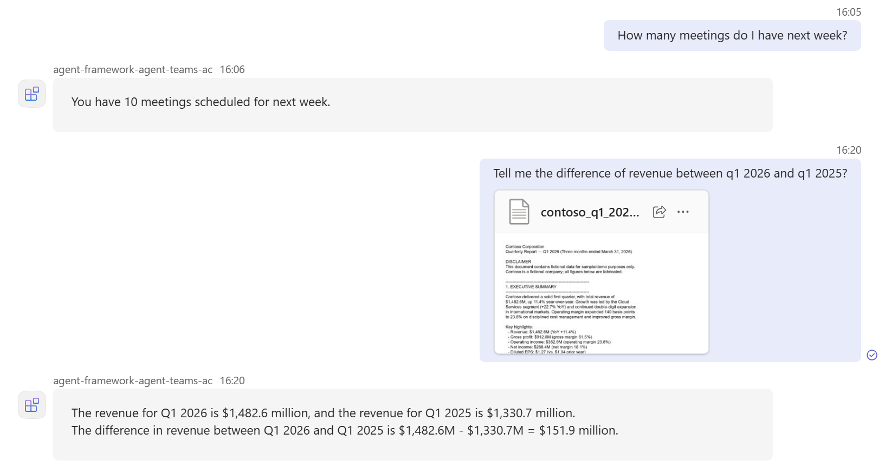

# What this sample demonstrates

An [Agent Framework](https://github.com/microsoft/agent-framework) hosted agent that can be deployed to Foundry and published to Teams.

After publishing, users can send messages with file attachments to the agent. It can also answer questions related with Teams and calendar.



## How It Works

### Model Integration

See [Program.cs](src/teams-activity-dotnet-agent-framework/Program.cs) for the full implementation. Work IQ tools are configured in toolbox that can be used by agent, so that it can answer questions to your Teams and calendar data.

### Agent Hosting

The agent is hosted using the [Agent Framework](https://github.com/microsoft/agent-framework) with `AgentHost.CreateBuilder()`, which provisions a REST API endpoint compatible with the OpenAI Responses protocol.

## Prerequisites

1. An existing Foundry project with a deployed model (or create them during setup in Option 1).
2. **[.NET 10 SDK](https://dotnet.microsoft.com/download/dotnet/10.0)** or later.
3. **Work IQ toolbox:** the agent answers Teams and calendar questions through a Work IQ toolbox. If declared in the sample's `azure.yaml`, `azd provision` (Option 1) creates it.

## Option 1: Azure Developer CLI (`azd`)

### Prerequisites

1. **Azure Developer CLI (`azd`)** — [Install azd](https://learn.microsoft.com/en-us/azure/developer/azure-developer-cli/install-azd)
2. Install the Foundry extension:

   ```bash
   azd ext install microsoft.foundry
   ```

3. Authenticate:

   ```bash
   azd auth login
   ```

### Initialize the agent project

No cloning required. Create a new folder and initialize from the manifest:

```bash
mkdir teams-activity-agent && cd teams-activity-agent
azd ai agent init -m https://github.com/microsoft-foundry/foundry-samples/blob/main/samples/csharp/hosted-agents/agent-framework/teams-activity/azure.yaml
```

Follow the prompts to configure your Foundry project and model deployment. If you don't have an existing Foundry project, `azd ai agent init` will guide you through creating one.

### Provision Azure resources (if needed)

If you don't already have a Foundry project and model deployment:

```bash
azd provision
```

### Run the agent locally

```bash
azd ai agent run
```

The agent host will start on `http://localhost:8088`.

### Invoke the local agent

In a separate terminal, send a request to the agent:

```bash
azd ai agent invoke --local "How many meetings do I have tomorrow?"
```

Or use curl directly:

```bash
curl -X POST http://localhost:8088/responses -H "Content-Type: application/json" -d '{"input": "How many meetings do I have tomorrow?"}'
```

The server responds with a JSON object containing the response text and a response ID. Continue the conversation by passing that ID as `previous_response_id`:

```bash
curl -X POST http://localhost:8088/responses -H "Content-Type: application/json" -d '{"input": "How are you?", "previous_response_id": "REPLACE_WITH_PREVIOUS_RESPONSE_ID"}'
```

### Deploy to Foundry

Once tested locally, deploy to Microsoft Foundry:

```bash
azd deploy
```

For the full deployment guide, see [Deploy a hosted agent](https://learn.microsoft.com/en-us/azure/foundry/agents/how-to/deploy-hosted-agent).

### Invoke the deployed agent

```bash
azd ai agent invoke "How many meetings do I have tomorrow?"
```

## Option 2: VS Code (Foundry Toolkit)

### Prerequisites

1. **VS Code** with the **[Foundry Toolkit](https://marketplace.visualstudio.com/items?itemName=ms-windows-ai-studio.windows-ai-studio)** extension installed.
2. [C# Dev Kit](https://marketplace.visualstudio.com/items?itemName=ms-dotnettools.csdevkit) extension.
3. Command Palette (`Ctrl+Shift+P`) → **C#: Check Workspace Requirements** to confirm the toolchain is ready.

### Run and debug the agent

Press **F5** to start the agent. The agent starts and the **Agent Inspector** opens automatically. Chat with the agent in the Inspector.

### Or run manually, then open the Inspector

1. Restore dependencies:

   ```bash
   dotnet restore
   ```

2. Configure the agent: copy `.env.example` to `.env` and fill in the required variables. The sample loads `.env` automatically on startup.

3. Sign in to Azure with the Azure CLI so `DefaultAzureCredential` can authenticate the terminal process (the **F5** path reuses the Azure sign-in from the Foundry Toolkit, so it doesn't need a separate `az login`):

   ```bash
   az login
   ```

4. Start the agent (listens on `http://localhost:8088`):

   ```bash
   dotnet run
   ```

5. Open the Command Palette (`Ctrl+Shift+P`) → **Foundry Toolkit: Open Agent Inspector**, then send a message to test.

### Deploy to Foundry

1. Open the Command Palette (`Ctrl+Shift+P`) and run **Foundry Toolkit: Deploy Hosted Agent**. The extension opens a **Deploy Hosted Agent** wizard and reads `agent.yaml` to auto-populate settings.
2. If prompted, complete **Foundry Project Setup** to select subscription and project.
3. On the **Basics** tab, choose deployment method (**Code** or **Container**) and confirm the agent name.
4. On **Review + Deploy**, confirm runtime details, pick **CPU and Memory** size, and click **Deploy**.
5. After deployment, invoke the agent in the Agent Playground and stream live logs from the **Logs** tab.

## Publishing the Agent

1. In the Foundry portal, click **Publish**, then choose **Publish to Teams and Microsoft 365**. For the full flow, see this [documentation](https://learn.microsoft.com/en-us/azure/foundry/agents/how-to/publish-copilot).
2. The Foundry portal creates the Azure Bot resource and configures the messaging endpoint automatically.
3. End users need to sign in the first time they access the agent.