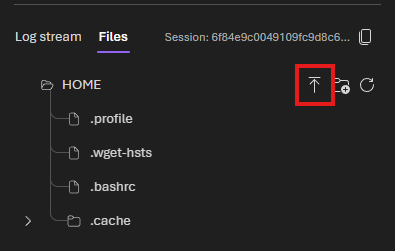

# What this sample demonstrates

An [Agent Framework](https://github.com/microsoft/agent-framework) agent that uses a local shell tool and a code interpreter tool for working with files, and hosted using the **Responses protocol**.

## How It Works

### Model Integration

The agent uses `FoundryChatClient` from the Agent Framework to create a Responses client from the project endpoint and model deployment. The agent supports both streaming (SSE events) and non-streaming (JSON) response modes.

See [main.py](src/agent-framework-agent-files-responses/main.py) for the full implementation.

### Agent Hosting

The agent is hosted using the [Agent Framework](https://github.com/microsoft/agent-framework) with the `ResponsesHostServer`, which provisions a REST API endpoint compatible with the OpenAI Responses protocol.

### Tools

This agent uses four tools:

1. **Get Current Working Directory Tool (`get_cwd`)** – Returns the current working directory of the agent host process.
2. **List Files Tool (`list_files`)** – Lists the files in a specified directory.
3. **Read File Tool (`read_file`)** – Reads the contents of a specified file.
4. **Code Interpreter Tool (`code_interpreter`)** – Allows the agent to execute Python code in a safe.

> In this sample, the filesystem tools are function tools defined in Python using the `@tool` decorator from the Agent Framework. The code interpreter tool is a managed tool provided by [Foundry Toolbox](https://learn.microsoft.com/en-us/azure/foundry/agents/how-to/tools/toolbox). Learn more about foundry toolbox integration with hosted agents with this [sample](../04_foundry_toolbox/).

## Option 1: Azure Developer CLI (`azd`)

### Prerequisites

1. **Azure Developer CLI (`azd`)** — [Install azd](https://learn.microsoft.com/en-us/azure/developer/azure-developer-cli/install-azd)
2. Install the AI agent extension:
   ```bash
   azd ext install microsoft.foundry
   ```
3. Authenticate:
   ```bash
   azd auth login
   ```

### Initialize the agent project

No cloning required. Create a new folder and initialize from the manifest:

```bash
mkdir my-files-agent && cd my-files-agent

azd ai agent init -m https://github.com/microsoft-foundry/foundry-samples/blob/main/samples/python/hosted-agents/agent-framework/responses/06-files/azure.yaml
```

Follow the prompts to configure your Foundry project and model deployment. If you don't have an existing Foundry project, `azd ai agent init` will guide you through creating one.

### Provision Azure resources (if needed)

If you don't already have a Foundry project and model deployment:

```bash
azd provision
```

### Run the agent locally

```bash
azd ai agent run
```

The agent host will start on `http://localhost:8088`.

> This sample requires a Foundry Toolbox. The `TOOLBOX_NAME` environment variable is configured in `azure.yaml` and will be prompted during `azd ai agent init`.

### Invoke the local agent

In a separate terminal, from the project directory:

```bash
azd ai agent invoke --local "Find the quarterly report under `{cwd}/resources` and tell me the difference of revenue between q1 2026 and q1 2025?"
```

> When running locally, the agent runs within the project directory, which contains the entire sample, so the `{cwd}/resources` path in the query above will allow the agent to locate the `resources` folder included with this sample and read the `contoso_q1_2026_report.txt` file from that folder.

### Deploy to Foundry

Once tested locally, deploy to Microsoft Foundry:

```bash
azd deploy
```

For the full deployment guide, see [Deploy a hosted agent](https://learn.microsoft.com/en-us/azure/foundry/agents/how-to/deploy-hosted-agent).

### Invoke the deployed agent

```bash
azd ai agent invoke "Hi!"
```

Run the following if you want to force a new session:

```bash
azd ai agent invoke --new-session "Hi!"
```

## Option 2: VS Code (Foundry Toolkit)

### Prerequisites

1. **VS Code** with the **[Foundry Toolkit](https://marketplace.visualstudio.com/items?itemName=ms-windows-ai-studio.windows-ai-studio)** extension installed.
2. For debugging Python in VS Code, install the **[Python](https://marketplace.visualstudio.com/items?itemName=ms-python.python)** extension pack.

### Set up the Python virtual environment

- Open the Command Palette (`Ctrl+Shift+P`) and run **Python: Create Environment...** to create a virtual environment in the workspace (or **Python: Select Interpreter** to use an existing one).
- Install dependencies in the virtual environment:

  ```bash
  # use uv to accelerate
  pip install uv
  uv pip install -r requirements.txt

  # or pure pip
  pip install -r requirements.txt
  ```

### Run and debug the agent

Press **F5** to start the agent. The agent starts and the **Agent Inspector** opens automatically. Chat with the agent in the Inspector.

### Or run manually, then open the Inspector

1. Set the required environment variables and sign in to Azure with the Azure CLI (`az login`).
2. Start the agent: `python main.py` (listens on `http://localhost:8088`).
3. Command Palette (`Ctrl+Shift+P`) → **Foundry Toolkit: Open Agent Inspector**, then send a message to test.

### Deploy to Foundry

1. Open the Command Palette (`Ctrl+Shift+P`) and run **Foundry Toolkit: Deploy Hosted Agent**. The extension opens a **Deploy Hosted Agent** wizard and reads `agent.yaml` to auto-populate settings.
2. If prompted, complete **Foundry Project Setup** to select subscription and project.
3. On the **Basics** tab, choose deployment method (**Code** or **Container**) and confirm the agent name.
4. On **Review + Deploy**, confirm runtime details, pick **CPU and Memory** size, and click **Deploy**.
5. After deployment, invoke the agent in the Agent Playground and stream live logs from the **Logs** tab.

## Uploading a file to a session

Deploying the agent won't automatically upload the files included with this sample to Foundry. To make these files available to the agent at runtime, you must upload them to a [hosted agent session](https://learn.microsoft.com/azure/foundry/agents/how-to/manage-hosted-sessions). Files are tied to a specific hosted agent session, so each time you start a new session you will need to upload the files again if the agent needs access to them during that session.

After you deploy the agent to Foundry, you have two ways to interact with the agent:

1. Using `azd ai agent invoke`.
2. Through the Foundry portal.

### Using `azd ai agent invoke`

After successfully deploying the agent to Foundry, run the following command:

> You must remain in the directory where your `azd` project is initialized so that the CLI can locate the deployed agent configuration.

```bash
azd ai agent invoke "Hi!"
```

The command will invoke the agent and the server will create a new session if one does not already exist for this interaction, returning the agent's response from the hosted agent session. Run the following if you want to force a new session:

```bash
azd ai agent invoke --new-session "Hi!"
```

Run the following command to upload a file to the hosted agent session:

```bash
azd ai agent files upload -f <path-to-contoso_q1_2026_report.txt>
```

> The above command will automatically detect the last active session and upload the file to that session without requiring you to explicitly provide a session ID. It is also possible to specify a particular session ID to upload the file to a specific hosted agent session by using the `--session-id` flag. Run `azd ai agent files upload -h` to see the full list of options and flags available for the `upload` command.

Once the file is uploaded to the hosted agent session, the agent will be able to access it during that session and use it to respond to queries that reference the uploaded file.

Invoke the agent again with a query that references the uploaded file to see how it can now use the file in its responses. For example:

```bash
azd ai agent invoke "Find the quarterly report under the home directory and tell me the difference of revenue between q1 2026 and q1 2025?"
```

### Using the Foundry Portal

Similar to using the `azd` CLI, you must invoke the agent first to create a session:


Once the session is created, you can grab the session ID and use `azd ai agent files upload --session-id <session-id>` to upload files to that specific hosted agent session.


Or you can upload files directly through the Foundry portal by navigating to Files tab in the agent playground:



## Next steps

- [Quickstart: Create a hosted agent](https://learn.microsoft.com/en-us/azure/foundry/agents/quickstarts/quickstart-hosted-agent) — end-to-end walkthrough using `azd`
- [Manage hosted agents](https://learn.microsoft.com/en-us/azure/foundry/agents/how-to/manage-hosted-agent) — monitor and manage deployed agents
